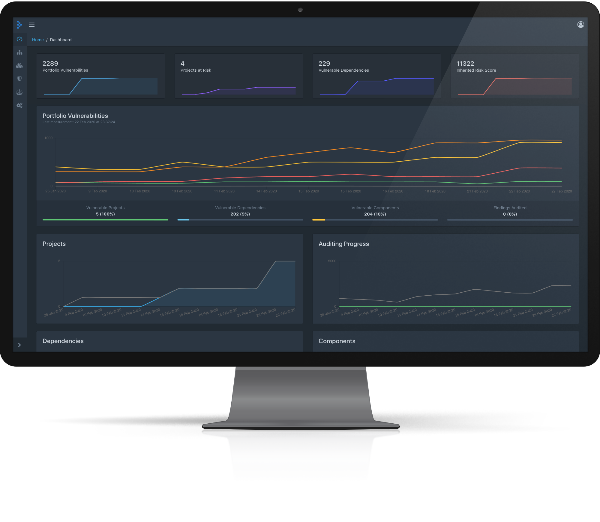

Dependency-Track is an intelligent Software [Supply Chain Component Analysis] platform that allows organizations to 
identify and reduce risk from the use of third-party and open source components. Dependency-Track takes a unique
and highly beneficial approach by leveraging the capabilities of [Software Bill-of-Materials] (SBoM). This approach 
provides capabilities that traditional Software Composition Analysis (SCA) solutions cannot achieve.

Dependency-Track monitors component usage across all versions of every application in its portfolio in order to 
proactively identify risk across an organization. The platform has an API-first design and is ideal for use in 
Continuous Integration (CI) and Continuous Delivery (CD) environments.

## Features
* Tracks component usage across all version of every application in an organizations portfolio
* Identifies multiple forms of risk including
  * Components with known vulnerabilities
  * Out-of-date components
  * Modified components
  * License risk
  * More coming soon...
* Integrates with multiple sources of vulnerability intelligence including:
  * [National Vulnerability Database] (NVD)
  * [NPM Public Advisories]
  * [Sonatype OSS Index]
  * [VulnDB] from [Risk Based Security]
  * More coming soon.
* Ecosystem agnostic with built-in repository support for:
  * Ruby Gems
  * Maven
  * NPM
  * NuGet
  * Python (Pypi)
  * More coming soon.  
* Includes a comprehensive auditing workflow for triaging results
* Configurable notifications supporting Slack, Microsoft Teams, Webhooks, and Email
* Supports standardized SPDX license ID’s and tracks license use by component
* Supports importing of [CycloneDX] and [SPDX] software bill-of-materials
* Supports importing of [Dependency-Check] reports to simplify the transition to SBoMs
* Easy to read metrics for components, projects, and portfolio
* Native support for Kenna Security, Fortify SSC, and ThreadFix
* API-first design facilitates easy integration with other systems
* API documentation available in Swagger 2.0 (OpenAPI 3 support coming soon)
* Supports internally managed users, Active Directory/LDAP, and API Keys
* Simple to install and configure. Get up and running in just a few minutes

[National Vulnerability Database]: https://nvd.nist.gov
[NPM Public Advisories]: https://www.npmjs.com/advisories
[Sonatype OSS Index]: https://ossindex.sonatype.org
[VulnDB]: https://vulndb.cyberriskanalytics.com
[Risk Based Security]: https://www.riskbasedsecurity.com
[Supply Chain Component Analysis]: https://www.owasp.org/index.php/Component_Analysis
[Software Bill-of-Materials]: https://www.owasp.org/index.php/Component_Analysis#Software_Bill-of-Materials_.28SBOM.29
[Dependency-Check]: https://www.owasp.org/index.php/OWASP_Dependency_Check
[CycloneDX]: https://cyclonedx.org
[SPDX]: https://spdx.org/